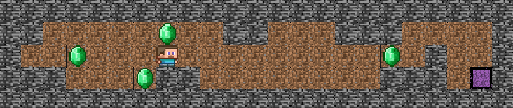

# so_long

## Description
**so_long** is a simple 2D game written in C using the MiniLibX (MLX) library. The objective of the game is to navigate a character through a map to collect items and reach the exit. This project is part of the 42 curriculum and focuses on applying knowledge of graphics programming, event handling, and memory management in a practical setting.



## Features
- **2D Map**: The game is rendered on a 2D grid map where each tile represents different elements (player, collectibles, walls, exits).
- **Player Movement**: The player can be controlled using keyboard inputs to move up, down, left, or right.
- **Collectibles**: The player must collect all items on the map before accessing the exit.
- **Game Events**: The game handles various events, such as player movement and window closure.

## Requirements
- **C Compiler**: Ensure you have `gcc` or any other C compiler installed.
- **MiniLibX**: The MLX library is required for rendering the game. Installation instructions can be found in the 42 resources or on the [official MLX GitHub page](https://github.com/42Paris/minilibx-linux).
- **Make**: Used for building the project.

## Installation
1. Clone this repository:
   ```bash
   git@github.com:mhmdjnde/so_long.git
